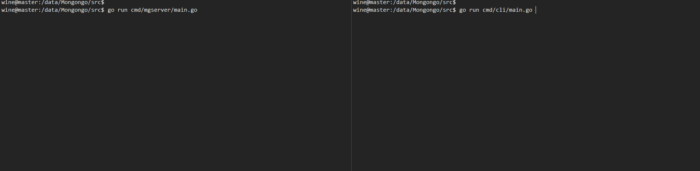

# Mongongo

Cassandra and Zookeeper in Go.

## Getting Started

* Install [Go 1.15.2](https://golang.org/dl/)
* Enable Go module and Setup Go package proxy

```shell
go env -w GO111MODULE=on
go env -w GOPROXY=https://goproxy.io,direct
```

* Download

```shell
git clone https://github.com/DistAlchemist/Mongongo.git
cd Mongongo/src
```

* Setup [tmux](https://github.com/tmux/tmux/wiki) for multi-terminal (recommended)

```shell
sudo apt install tmux
```

* Create a new session of tmux:

```shell
tmux new -s mg
```

* Inside one terminal, run Mongongo server:

```shell
go run cmd/mgserver/main.go
```

* Inside another terminal, run command line interface:

```shell
go run cmd/cli/main.go
```

## Design

* The design mostly follow the first commit version of [Cassandra](https://github.com/apache/cassandra)

* Currently only a dummy `SET` operation is supported:

```shell
SET tableName.columnFamilyName['rowKey']['columnKey'] = 'value'
```

* The project is roughly divided into three layers:
  * Command Line Interface (parse SQL to command)
  * Mongongo Server (determine which nodes need to perform the operation, send the operation to their storage layer)
  * Storage Layer (perform specific operation, update commitLog, memTable, ssTable etc.)

* TODO
  * Rewrite a comprehensive SQL parser.
  * Build storage layer.
  * Add zookeeper-like support.


## Contributing

* First clone the project:

```shell
git clone git@github.com:DistAlchemist/Mongongo.git
```

or sync with the remote:

```shell
git pull
```

* Create a new branch `dev-featurename` 

```shell
git checkout -b dev-test
```

* After you have made some progess, first commit it locally:

```shell
git status 
# make sure to add unwanted files to .gitignore
git add . # add all change files 
git commit -m "rewrite sql parser" # commit locally
```

* You may commit many times locally. Once you feel good about your branch, push it to remote.

```shell
git push origin dev-test # push local branch to origin with branch name `dev-test`
```

Then it should be really convenient to manully create pull request from github panel.

## Example



## License

MIT License