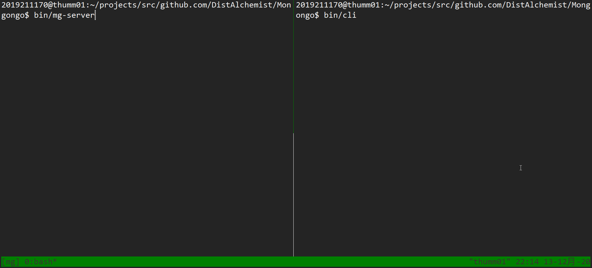

# Mongongo

[](https://opensource.org/licenses/MIT)
[](https://golang.org/)


Cassandra in Go.

## Getting Started

* Install [Go 1.15](https://golang.org/dl/)
* Enable Go module and Setup Go package proxy

```shell
go env -w GO111MODULE=on
go env -w GOPROXY=https://goproxy.io,direct
```

* Download

First setup your Go project structure, put the following into your `~/.bashrc`:

```shell
export GOPATH=~/projects/go  # any where you like, except $GOROOT
export mg=$GOPATH/src/github.com/DistAlchemist
```

Then make directories:

```shell
mkdir -p $mg
cd $mg
git clone https://github.com/DistAlchemist/Mongongo.git
# or git clone git@github.com:DistAlchemist/Mongongo.git
cd Mongongo
```

* Setup [tmux](https://github.com/tmux/tmux/wiki) for multi-terminal (recommended)

```shell
sudo apt install tmux
```

* Create a new session of tmux:

```shell
tmux new -s mg
```

* Build files:

```shell
cd $mg
cd Mongongo
make
```

* Inside one terminal, run Mongongo server:

```shell
bin/mg-server
```

* Inside another terminal, run command line interface:

```shell
bin/cli 
```

## Design

* The design mostly follows the *very* early version of [Cassandra](https://github.com/apache/cassandra)

* Currently only simple `SET` and `GET` operation is supported:

```shell
 SET table1.standardCF1['row1']['column1']='value' 
 GET table1.standardCF1['row1']['column1'] 
```

* The project is roughly divided into three layers:
  * Command Line Interface (parse SQL to command)
  * Mongongo Server (determine which nodes need to perform the operation, send the operation to their storage layer)
  * Storage Layer (perform specific operation, update commitLog, memTable, ssTable etc.)

* TODO
  * Add more tests.
  * Strengthen QL support.


## Contributing

* See [CONTRIBUTING](./CONTRIBUTING.md)
## Example



## License

MIT License
